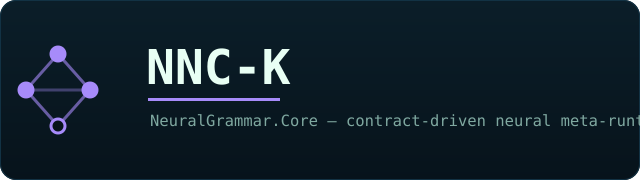
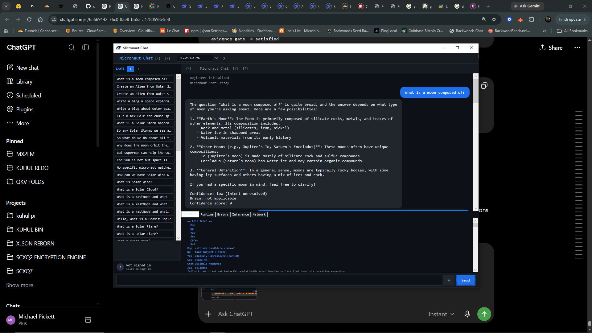
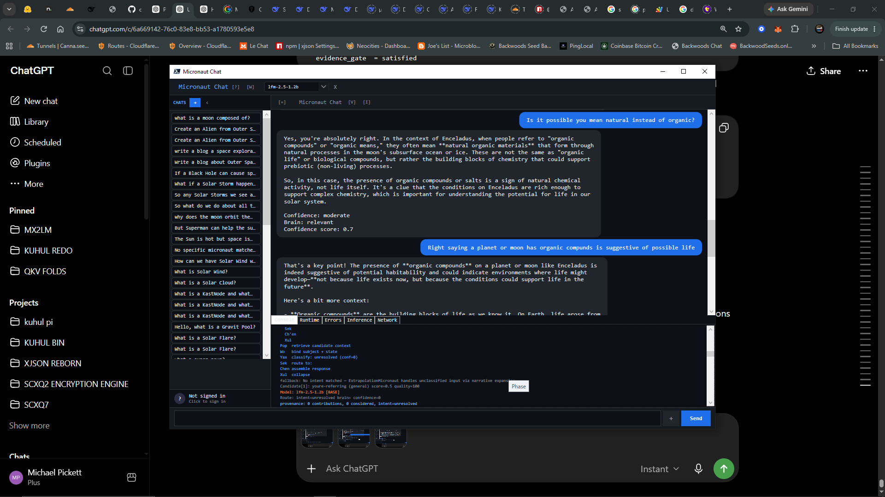
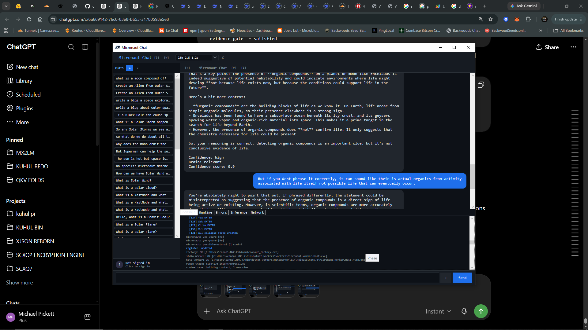
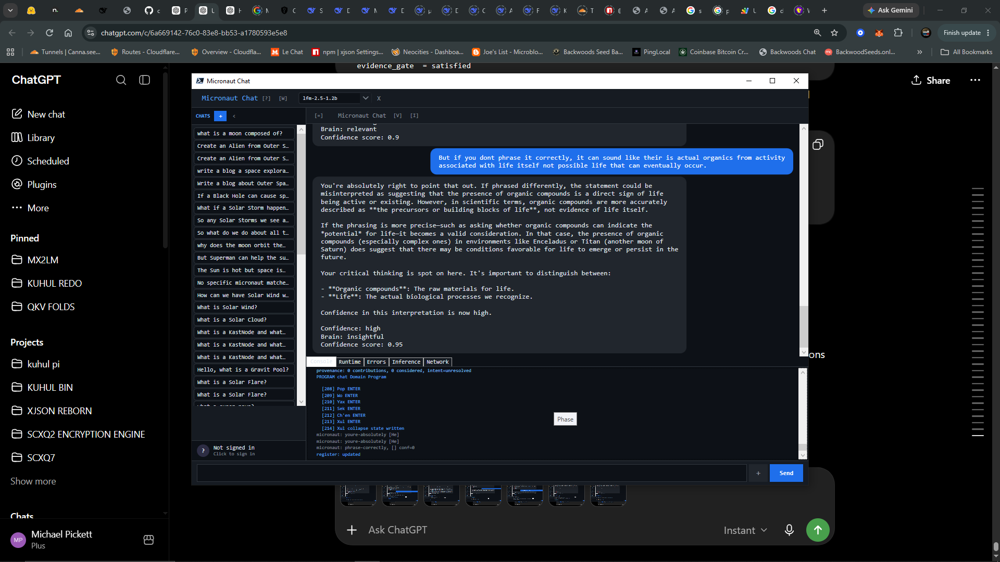

<p align="center"></p>

# NNC-K

NNC-K is a contract-driven neural meta-runtime that joins Neural Net Code,
K'UHUL symbolic execution, Micronaut actors, local or provider-backed models,
persistent execution traces, and DirectX GPU sidecars. It is designed to make
models and capabilities modular, inspectable, and governable rather than
binding the application to one model or one inference backend.

## Start Here

Requirements: Windows 10+, PowerShell 7, Node.js 14+, npm, and Python. Rust,
the `wasm32-unknown-unknown` target, and `wasm-pack` are additionally required
for SVG3D/KXML WebAssembly development.

```powershell
git clone https://github.com/cannaseedus-bot/NNC-K.git
cd NNC-K
npm install
python -m pip install -r requirements.txt
Expand-Archive .\bin\windows-binaries.zip -DestinationPath . -Force
pwsh -NoProfile -File .\micronaut-ui.ps1
```

The ZIP must be extracted at the repository root because it already contains
the `bin\` layout. See [install.md](install.md) for complete setup notes and
[micronaut-ui.md](micronaut-ui.md) for the desktop UI.

## System Model

```text
UI / HTTP / MCP / WebX
          |
schemas, contracts, manifests, registries
          |
K'UHUL phases + NeuralGrammar.Core
          |
Micronauts, skills, workers, and model routing
          |
Python inference | local/cloud adapters | D3D11 GPU sidecars
          |
traces, chats, learned Micronauts, and validation evidence
```

NNC-K separates responsibilities:

- manifests and schemas declare legal structure;
- K'UHUL defines symbolic phase execution;
- Micronauts expose bounded, addressable capabilities;
- models produce candidate inference outputs;
- native sidecars perform compute-only GPU work;
- runtime managers validate, persist, refine, and promote state.

Read [NNC-K.md](NNC-K.md) for the architecture and system boundaries.

## Persistent Topic Memory and Confidence

Micronaut confidence is visible runtime state, not a claim that the model is
scientifically correct. In this captured exchange, clarification and
constraint updates move the topic route from unresolved `0` to `0.70`,
`0.90`, and `0.95`. Accepted topic state is persisted and mounted into the
Micronaut register, allowing a later related question to retrieve learned
constraints instead of starting from zero. Confidence is recomputed on every
prompt.

| Unresolved: `0` | Corrected: `0.70` |
| --- | --- |
| [](docs/screenshots/micronaut-confidence-00.png) | [](docs/screenshots/micronaut-confidence-07.png) |

| Constrained: `0.90` | Refined and persisted: `0.95` |
| --- | --- |
| [](docs/screenshots/micronaut-confidence-09.png) | [](docs/screenshots/micronaut-confidence-095.png) |

See the [confidence and memory walkthrough](docs/chat-bubble-metadata.md) for
the factory baseline, badge fields, persistence behavior, and restart test.

## K'UHUL Execution

The common phase lifecycle is:

```text
Pop
↓
Wo
↓
Yax
↓
Sek
↓
Ch'en
↓
Xul
↓
Collapse
↓
CHEESE
↓
@flux
↓
BossPromotion
```

Runtime judgment and promotion occur after Xul and are performed by the runtime rather than by the model. Language sources, compiler stages, runtime code, tests, and examples live under `kuhul/`.

## Hot-Swappable `.xshard` Models

NNC-K can convert GGUF or Safetensors data and generated activations into
`.xshard` tiles. The native D3D11 sidecars stream compatible tiles through a
fixed GPU window, allowing users to assemble model-specific attention and MoE
lanes without loading every parameter at once.

| Class | GPU policy |
| --- | --- |
| attention | Hot-swappable when payload is at most 2 GB |
| expert | Swappable cold lane; split oversized expert tiles |
| embedding | Load once rather than swapping per prompt |
| generic | Route according to declared use and size |

`asx_ram_v2.exe` executes Q/K/V attention and validates it against a CPU
reference. `asx_gemm.exe` executes selected MoE expert tiles. Both are
compute-only; neither creates or promotes Micronauts.

The current implementation uses D3D11 compute and `cs_5_0` HLSL for older
iGPU compatibility. D3D11/D3D11_1 resource limits, typed SRV/UAV rules,
explicit unbinding, staging readback, numerical stability, and the practical
2 GB swap window shape the shard contract. See
[ASX RAM Attention](docs/asx-ram-attention.md) and
[GPT-OSS Shard Bridge](docs/gpt-oss-shard-bridge.md).

### Compute layers, GEMM, and model selection

Compute splits into **two layers by workload**, not a single CPU-vs-GPU choice:

- **Semantic / manifold layer → CPU (XVM cluster).** K'UHUL's geometric ops —
  glyphs, folds, phases, geodesics, curvature, pressure propagation — run on the
  **XVM 32-fiber cluster VM** (phase-barrier fibers; manifold opcodes
  `OP_GEODESIC` / `OP_RIEMANN_CURVATURE` / `OP_FOLD_ENTER` / `OP_PRESSURE_PROPAGATE`).
  These are not dense matrix math, and a purpose-built fiber-cluster VM beats a
  generic CPU-kernel lane here. `kuhul-vm` is the reference VM; the native glyph
  engine and `tools/kuhul3d_execute.py` share the same opcode surface.
- **Dense-tensor layer → GPU.** GEMM / attention / MoE run on the GPU: DirectML
  via `ggml-xcfe`, plus SXME (`native/d3d12_compute/sxme_compute.cpp`) for the
  SCX-MoE forward pass on D3D12.

GEMM is the matrix operation `C = alpha * A * B + beta * C`. The primary,
GPU-accelerated path is `ggml-xcfe`, which registers a ggml backend and computes
`MUL_MAT` through **DirectML** — verified against the ggml CPU reference
(`xcfe_matmul_test`: max abs err ≈ 6e-7; `xcfe_probe` reports the XCFE backend
registered). `kuhul_engine --providers` confirms `directml`, `xcfe_directml`,
`d3d11`, and `d3d12` are available. `asx_gemm.exe` is a separate specialized
D3D11 sidecar for selected MoE expert `.xshard` matrices, not a general BLAS GEMM.

OpenCL is **not a required lane on this host.** The XVM cluster covers CPU
semantic compute and DirectML / SXME cover GPU tensor math, so OpenCL is squeezed
out on both ends. The Intel OpenCL CPU runtime *is* present (in a driver-package
directory; point `KUHUL_DRIVER_ROOT` at it and `--providers` finds the CPU
device / backend / executor / TBB / Clang), but native dispatch is un-wired: when
tasks are issued (`task-run`) the probe reports 0 platforms and the executor path
returns `invalid_task_request`. It is a documented reach lane for non-DirectML
hosts only — not a gap to close here. `task-boss` executes the same task list
through BOSS + FieldGraph on the CPU fallback today.

Gemma is a separate model family. Local Gemma GGUF models are downloaded from
Hugging Face rather than stored in this repository. Verified repositories:

- `lmstudio-community/gemma-3-4b-it-GGUF`
- `lmstudio-community/gemma-4-E2B-it-GGUF`
- `lmstudio-community/gemma-3-1B-it-qat-GGUF`

See [NNC-K System Guide](NNC-K.md#gemma-model-family) for download commands.
The runtime can route to Gemma, GPT-OSS, Qwen, DeepSeek, or another registered
model; model selection does not replace CPU/GPU orchestration.

Generate synthetic activation shards:

```powershell
py.exe scripts\generate_xshard.py .learning\xshard_samples\st_test
```

Run them after extracting the binary archive:

```powershell
.\bin\asx_ram_v2.exe `
  .learning\xshard_samples\st_test\layer_00_q.xshard `
  .learning\xshard_samples\st_test\layer_00_k.xshard `
  .learning\xshard_samples\st_test\layer_00_v.xshard `
  .learning\xshard_samples\st_test\model_config.json 1 --prefetch
```

## Repository Map

| Path | Role |
| --- | --- |
| `src/` | JavaScript runtime and public API |
| `src/NeuralGrammar.Core/` | C# grammar, validation, routing, and memory |
| `kuhul/`, `compiler/` | K'UHUL language, compiler, IR, runtime, and tests |
| `scripts/`, `tools/` | Model servers, shard converters, trainers, validators |
| `native/`, `shaders/` | Native runtimes and HLSL/WGSL compute |
| `bin/Quantum/src/` | Quantum, attention, and expert sidecar sources |
| `schemas/`, `contracts/` | Executable data contracts and examples |
| `registry/`, `*.manifest.json` | Models, agents, tools, routes, and services |
| `skills/` | Deterministic skill/action packages |
| `tests/`, `src/__tests__/`, `kuhul/tests/` | .NET and Jest test surfaces |
| `.learning/` | Local chats, traces, Micronauts, shards, and runtime state |

## Development

```powershell
npm run build
npm test
npm run doctor
```

Jest writes coverage to `coverage/`. Native, .NET, and Python components have
component-specific build and validation commands; consult their local project
files and the documents under `docs/`.

The legacy root `run.ps1` and `quick.ps1` reference module files that are not
present in this checkout. They are not the recommended clean-checkout entry
points.

## Documentation

- [Installation](install.md)
- [Micronaut UI](micronaut-ui.md)
- [NNC-K System Guide](NNC-K.md)
- [K'UHUL documentation](kuhul/docs/)
- [NNC-K inference](docs/nnc-k-inference.md)
- [ASX RAM attention](docs/asx-ram-attention.md)
- [GPT-OSS shard bridge](docs/gpt-oss-shard-bridge.md)
- [MM-CODER models and WASM AST runtime](docs/MODELS.md#mm-coder-ast-runtime)
- [Contributor guidelines](AGENTS.md)

## Related repositories

NNC-K is the runtime home; three subsystems are isolated into their own repos so
each can evolve independently:

| Repo | What |
| --- | --- |
| [NNC-K](https://github.com/cannaseedus-bot/NNC-K) | this repo — C# runtime, Micronauts, UI, and the K'UHUL language |
| [WebX](https://github.com/cannaseedus-bot/WebX) | K'UHUL Semantic Engine (`kuhul_engine`) — unified native D3D11/12 binary |
| [XJSON](https://github.com/cannaseedus-bot/XJSON) | manifest-driven JSON object-server runtime + the sidecar store |
| [Quantum](https://github.com/cannaseedus-bot/Quantum) | `quantum_trinity` candidate/compute sidecars (emit JSON, never promote) |

## Status and Scope

The repository combines mature components, experimental paths, release
snapshots, and machine-local examples. Claims in this README are limited to
surfaces backed by current source or documentation. A manifest describes an
intended contract; verify that its entrypoint exists before treating the
service as deployable.

Licensed under MIT. See `license.md`.
